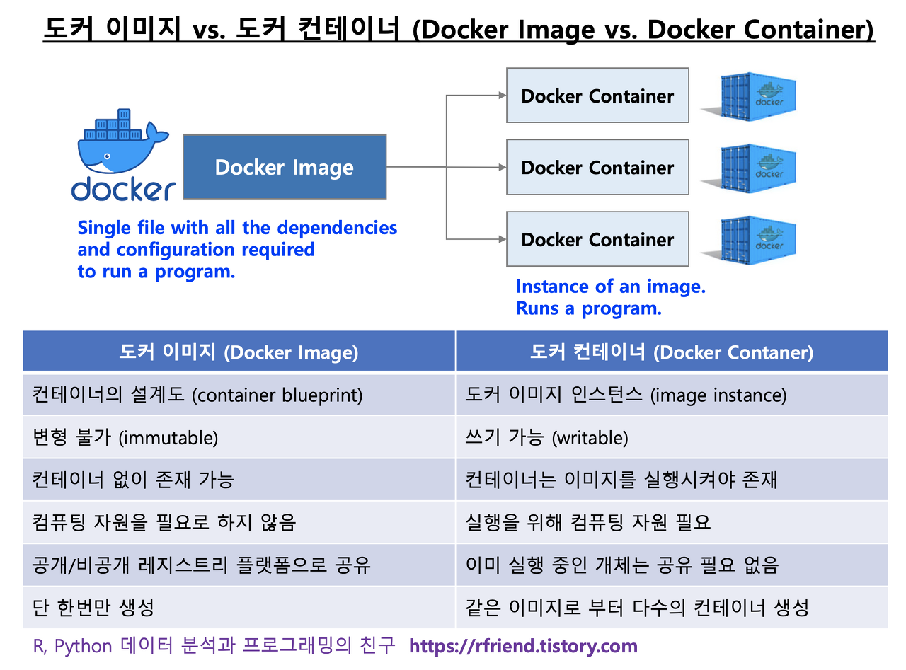

# 도커 소개

## 도커란?
* Go언어로 작성된 리눅스 **컨테이너** 기반으로 하는 오픈소스 가상화 플랫폼   
* 특정한 서비스를 패키징하고 배포하는데 유용한 오픈소스 프로그램

## 도커는 왜 사용하나?
**Docker을 사용하면 환경에 구애받지 않고 애플리케이션을 신속하게 배포, 확장할 수 있음**

### 기존방식(가상머신)의 단점
* OS를 가상 머신 마다 중복으로 설치하기 때문에 이밎 크키가 커짐
* 이미지가 커서 네트워크로 배포하는 것이 어려움
* 배포 및 버전 관리가 어려움
	* OS를 포함하고 있어 용량이 크기 때문에 네트워크를 통해 배포하기가 어려움
	* 이미지의 버전관리 즉 변경사항 추적이 거의 불가능
* 가상 머신은 OS안에 OS를 포함하여 가상화하여 매우 느리고 비효율적임

### 도커의 장점
* 기존 가상 머신에 비해 성능 오버헤드가 적음
* 빠르고 쉬운 애플리케이션 배포 --> 도커 이미지로 만들어서 운영서버에 전달하면됨
* 이미지 버젼 관리 쉬움
* 각 컨테이너 사이에 독립적인 동작 환경 제공 
* 마이크로 서비스 구조로 변화 용이

## 도커 이미지와 컨테이너

### 도커 이미지(Docker Image)란?
* 컨테이너를 실행할 수 있는 실행파일, 설정 값들을 가지고 있는 것으로, 더 이상 의존성 파일을 컴파일하거나 이것저것 설치할 필요가 없는 상태의 파일을 의미
* 도커 이미지를 컨테이너에 담고 실행시키면 해당 프로세스가 동작

### 도커 컨테이너(Docker Container)란?
* 도커 이미지의 실행 가능한 인스턴스
* 격리된 실행 소프트웨어 또는 동일한 애플리케이션의 빌딩 블록으로 볼 수 있음

### 도커 이미지와 컨테이너의 차이
* 도커 이미지는 설계서, 컨테이너는 설계서로 만들어진 제품
* 이미지가 중간에 바뀌어도 기존 컨테이너는 영향을 받지 않음 
<!--  -->

### 도커 이미지의 생성 방식
* 도커 이미지는 여러 개의 읽기 전용 레이어로 구성되고, 파일이 추가되면 기존 이미지에 새로운 레이어를 추가하여 구성을 올려주는 방식으로 생성
* 따라서 도커는 여러 개의 레이어를 묶어 하나의 파일시스템으로 사용할 수 있게 해줌