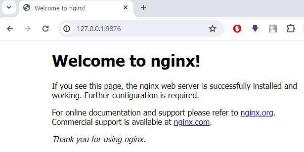

# 도커 설치

## 윈도우10/11에서 도커 설치
**Home에디션의 경우 WSL2 설치 필수, Pro 및 Enterprise 버전은 WSL2 및 Hyper-V기반 도커 엔진 사용가능**

1. 아래 링크에서  Download for Windows를 클릭해 Docker Desktop Installer를 다운로드

    [Docker Desktop for Mac and Windows | Docker](https://www.docker.com/products/docker-desktop/)

2. 다운로드 받은 Docker Desktop Installer.exe를 실행하면 사용자 계정 컨트롤이 나타나며, 설치 진행을 위해 ’예’를 클릭해 안내에 따라 설치를 진행

3. 설치 중간에 Configuration이 나타나면, 둘 다 체크하고 설치를 진행(첫 번째 옵션은 WSL 관련, 2번째 옵션은 바탕화면에 아이콘 추가할지 여부)

4. Docker Desktop 설치가 진행됩니다. 몇 분 정도 시간이 걸리니 완료될 때까지 기다림

5. 설치가 끝나면 Installation succeeded 메시지가 나타나며, 시스템 상태에 따라 재시작이나 로그아웃 할 수 있음

6. 설치된 Docker Desktop 실행
    * 시스템에 WSL2가 활성화되어있다면 Docker는 기본적으로 WSL2를 백엔드로 Docker Engine을 실행
    * 성공적으로 Docker가 실행되면 Tutorial이 나타남
  
7. WSL 통합 설정을 진행을 위해 도커 데스크톱에서 설정(Settings)으로 들어감    
    * General 설정에서 'Use the WSL 2 based engine'에 체크가 되어있는지 확인
      * 일반적으로 미리 체크가 되어있음
      * 되어있지 않다면 체크하고 오른쪽 아래의 Apply & Restart 버튼을 클릭
    * Resource > WSL Integration 메뉴로 이동하여 'Enable integration with my default WSL distro' 체크되어 있는지 확인
      * 체크가 되어있지 않다면 체크하고 오른쪽 아래의 Apply & Restart 버튼을 클릭하여 도커 엔진 재실행


## 우분투(리눅스)에서 도커 설치
1. 도커 APT 저장소 셋업
```bash
# Add Docker's official GPG key:
sudo apt-get update
sudo apt-get install ca-certificates curl
sudo install -m 0755 -d /etc/apt/keyrings
sudo curl -fsSL https://download.docker.com/linux/ubuntu/gpg -o /etc/apt/keyrings/docker.asc
sudo chmod a+r /etc/apt/keyrings/docker.asc

# Add the repository to Apt sources:
echo \
  "deb [arch=$(dpkg --print-architecture) signed-by=/etc/apt/keyrings/docker.asc] https://download.docker.com/linux/ubuntu \
  $(. /etc/os-release && echo "$VERSION_CODENAME") stable" | \
  sudo tee /etc/apt/sources.list.d/docker.list > /dev/null
sudo apt-get update
```

2. 도커 최신 패키지 설치

```bash
sudo apt-get install docker-ce docker-ce-cli containerd.io docker-buildx-plugin docker-compose-plugin
```

3. 실행 확인
```bash
sudo docker run hello-world
```


## 도커 설치 확인
**윈도우10/11은 Windows Terminal을 열어서 정상 동작하는지 간단하게 테스트**

1. PowerShell 탭을 하나 열고 wsl 명령어로 Docker 전용 머신이 실행중인 것을 확인
```
$  wsl -l -v
  NAME                   STATE           VERSION
* docker-desktop         Running         2
  docker-desktop-data    Running         2
```
2. docker version 명령으로 Docker 서버와 클라이언트 정보를 확인
```
$  docker version
Client:
 Cloud integration: v1.0.35+desktop.5
 Version:           24.0.6
 API version:       1.43
 ...

Server: Docker Desktop 4.25.1 (128006)
 Engine:
  Version:          24.0.6
  API version:      1.43 (minimum version 1.12)
 ...
```
3. docker ps로 실행중인 컨테이너를 확인
    * 아직 아무것도 실행중이지 않은 것을 확인할 수 있음

```
$ docker ps
CONTAINER ID   IMAGE     COMMAND   CREATED   STATUS    PORTS     NAMES
```

**우분투에서는 콘솔창에서 정상 동작하는지 간단하게 테스트**
1. 도커 실행상태 확인

```
sudo systemctl status docker
```
2. 도커 실행

```
sudo docker run hello-world
```


## 도커 동작 확인
**nginx 이미지로 간단한 서버 테스트**
1. 웹 브라우저를 열어 127.0.0.1:9876에 접속
   * 현재 9876포트에 동작하는 서버가 없으므로 '사이트에 연결할 수 없음' 상태임
2. docker run 명령어로 nginx 이미지 기반 컨테이너를 실행하면, 이미지를 자동으로 다운받고 실행해줌
```
$ docker run -p 9876:80 -d nginx:latest
Unable to find image 'nginx:latest' locally
latest: Pulling from library/nginx
578acb154839: Pull complete
e398db710407: Pull complete
85c41ebe6d66: Pull complete
7170a263b582: Pull complete
8f28d06e2e2e: Pull complete
6f837de2f887: Pull complete
c1dfc7e1671e: Pull complete
Digest: sha256:ad90e201fc869b27d2f3d2ff8b7c3f575021986d0998806766012d28096cd14f
Status: Downloaded newer image for nginx:latest
83333752766cda82d28864b919772835bdb314fde80e1604ee347dd86b9d0bd7
```

3. docker ps로 실행중인 컨테이너 확인
```
$ docker ps
CONTAINER ID   IMAGE          COMMAND                   CREATED              STATUS              PORTS                  NAMES
83333752766c   nginx:latest   "/docker-entrypoint.…"    About a minute ago   Up About a minute   0.0.0.0:9876->80/tcp   priceless_sinoussi
```

4. 다시 웹 브라우저에서 127.0.0.1:9876에 접속해보면, 이제 ‘Welcome to nginx!’ 메시지 확인



5. 사용하지 않는 컨테이너는 docker rm 명령어로 삭제
   * 83333752766c는 docker ps에서 확인할 수 있는 컨테이너 ID
```
$ docker rm -f 83333752766c
83333752766c
```
