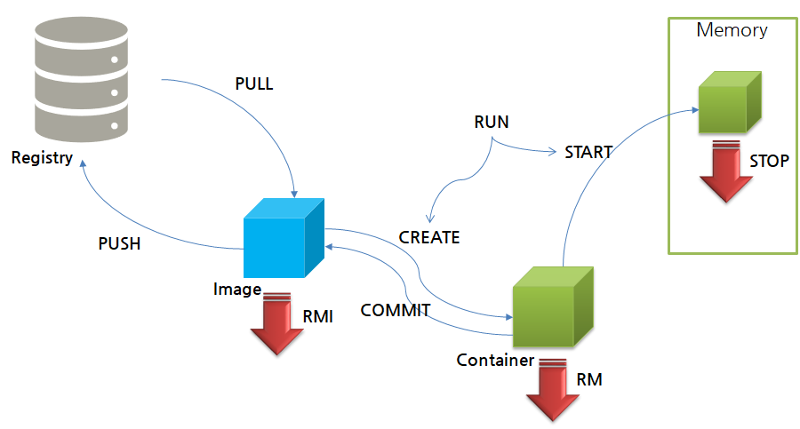

# 도커의 라이프싸이클
* pull 을 통해 이미지를 다운로드 받고 push 를 통해 Registry에 이미지 저장 가능(push 할 때 권한 필요)
* pull된 이미지를 실행하려면 create 를 통해 container를 생성해야하며, start 를 통해 container를 메모리에서 실행 가능
* run 명령어를 통해 pull , create , start 가 한 번에 수행되어 애플리케이션이 실행됨
* run과 start 명령어의 차이점은 run의 경우 이미지를 바탕으로 새로운 컨테이너를 띄우는 것이고, start는 중지된 컨테이너를 다시 시작
* 이미 pull 되어 있는 이미지의 경우 run 명령어를 사용하며 create 와 start 가 다시 실행됨
* run 을 수행할 때마다 container가 생성되므로, create 가 필요할 때만 사용하기⇒ create 와 start 를 따로 사용하는 습관을 가지는 게 BEST!!!
* stop 을 통해 container 중지 가능하며, 삭제를 원하는 경우 rm 을 사용하면됨
* 이미지 삭제를 원하는 경우 rmi 를 사용하면 됨
* 쓰고 있던 container에 대한 파일들을 이미지로 만들고 싶은 경우 commit 사용

