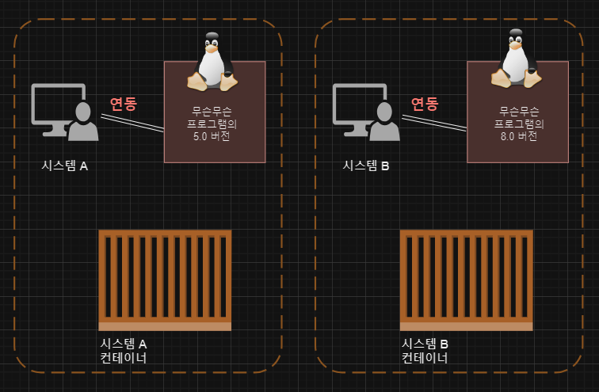

> 해당 글은 [그림과 실습으로 배우는 도커 & 쿠버네티스](https://wikibook.co.kr/dkkb/)를 보고 정리한 내용 입니다.
 
> ⚠️ 해당 글은 2024년 1월 10일부터 작성되었습니다.


# ▣ 1장: 도커란 무엇인가?
## 1-1 도커란 무엇인가?
- 도커는 `데이터 또는 프로그램을 격리시키는` 기능을 제공는 소프트웨어
  - 주로 서버에 사용
- `컨테이너`: PC 또는 서버 상의 환경을 독립되게 분할하는 조립형 창고
- `도커`: 컨테이너 기능을 제공하는 소프트웨어
  - 도커를 사용하여면 도커 엔진을 설치해야 함
- 컨테이너를 만들려면 이미지가 필요
- 담고 있는 소프트웨어의 종류에 따라 다양한 이미지를 사용
  - 예) MySQL 컨테이너를 만들려면 MySQL 이미지 필요
- 컨테이너는 여러개 만들 수 있음
- 리눅스 운영체제 필요 ➡️ 리눅스 운영체제에서 사용하는 것을 전제
  - 윈도우나 macOS에서도 구동되나 `내부적으로 리눅스가 사용`
  - `컨테이너에서 동작시킬 프로그램도 리눅스용 프로그램`


<em>출처:[ksu9704.log](https://velog.io/@ksu9704/Docker-tqjxw39x)</em> 

- 데이터나 프로그램을 독립된 환경에 격리해야 하는 이유?
  - 대부분의 프로그램은 단독으로 동작하는 것이 아니라 어떤 실행 환경이나 라이브러리, 다른 프로그램등을 이용해 동작
  - 다른 프로그램과 특정 폴더와 디렉토리 공유하거나 같은 경로에 설정 정보를 저장하는 경우도 있음 ➡️ 서로 영향을 주고 받을 수 있음
  - 특정 프로그램 업데이트시 다른 프로그램이 영향 받을 수도 있음


<em>출처:[ksu9704.log](https://velog.io/@ksu9704/Docker-tqjxw39x)</em> 

- 컨테이너 안에 들어있는 프로그램은 다른 프로그램과 격리된 상태
  - 독립된 환경이므로 여러 컨테이너에서 같은 프로그램을 실행할 수 있음



<em>출처:[ksu9704.log](https://velog.io/@ksu9704/Docker-tqjxw39x)</em> 

## 1-2 서버와 도커
- 서버는 `어떤 서비스(service)를 제공(Serve)하는 것`
  - 기능적 의미의 서버: ex) 웹 기능 제공 서버, 이메일 기능 제공 서버 
  - 물리적 의미의 서버: 실물로 존재하는 장치
- 도커는 하나의 물리적 서버에 여러 개의 논리적 서버를 둘 수 있게 해줌 
- 서버의 운영체제는 주로 `리눅스`가 사용
- 컨테이너를 이용해 여러 가지 서버 기능을 안전하게 함께 실행 가능
  - 물리적 서버 수 감소 ➡️ 비용 감소
- 컨테이너는 자유로이 옮길 수 있음
  - 정확히는 컨테이너의 정보를 내보내기한 다음  ➡️ 다른 도커엔진에서 복원
- 도커는 물리적 환경의 차이, 서버 구성의 차이를 무시하게 해줌 
 
# ▣ 2장: 도커의 동작 원리
## 2-1 도커의 동작 원리
- 운영체제 위에 도커 엔진이 동작하고 그 위에서 컨테이너가 동작
- 모든 컨테이너에는 `리눅스 운영체제 비슷한 무언가`가 들어 있음
- 도커 엔진 아래에도 리눅스 운영 체제가 있는데, 컨테이너 속에 또 리눅스 운영체제(비슷한 것)가 있음
  - 컨테이너 속에 운영체제의 주변 부분이 들어 있어 프로그램의 명령을 전달받고 이를 밑바탕이 되는 커널에 전달하는 구조
  - 즉, 주변 부분만 컨테이너에 넣고, 커널은 및바탕에 빌려 쓰기 ➡️ `가벼움` 
- 도커는 기본적으로 `리눅스용`이다


<em>출처: [https://gayuna.github.io/](https://gayuna.github.io/docker/docker/)</em> 

## 2-2 도커 허브와 이미지, 그리고 컨테이너
- 이미지는 컨테이너를 만드는데 사용
  - 실제로 사용하는 것은 컨테이너, 이미지를 그대로 사용하는 일은 없음
- 컨테이너로도 이미지를 만들 수 있음
  - 개조된 컨테이너로 부터 새롭게 만든 이미지를 사용해 개조된 컨테이너를 대량으로 만들 수 있음


<em>출처: [https://ryu-e.tistory.com/10](https://ryu-e.tistory.com/10)</em> 

- 다른 물리 서버에 설치된 도커 엔진으로 컨테이너를 이동시킬 수 있음
- [도커 허브](https://hub.docker.com/)를 통해 다양한 이미지를 이용할 수 있음
  - 공개된 컨테이너 이미지가 모여 있는 곳 ➡️ 다운로드 가능
  - 운영체제, 소프트웨어 포함된 이미지, 변종(배포판, 버전 등) 이미지 등 제공
- 안전한 컨테이너 이미지를 고르는 팁
  - 공식 이미지 사용
    - 도커에서 직접 배포 or 해당 SW 개발/관리 조직에서 제공
    - 보안 문제 해결
  - 커스텀 이미지를 직접 만들어 사용
- 컨테이너는 다양한 형태로 조합 가능
  - 기본원칙: `한 컨테이너에 하나의 프로그램` ➡️ `보안`에 유리 
  - 물론 한 컨테이너에 프로그램을 모두 집어넣어도 됨 ➡️ `유지 보수 어려움`- 


## 2-3 도커 컨테이너의 생애주기와 데이터 저장
- 도커 컨테이너는 `쓰고 버리는` 일회용품
  - 새로운 버전이 나오면 새로운 컨테이너로 갈아타기 권장 ➡️ 유지 보수가 용이 
- **컨테이어의 생애주기**: `만들고`, `실행하고`, `종료하고`, `폐기한` 다음 새로운 컨테이너를 `만드는` 일련의 과정
- 컨테이너를 폐기하면 그속의 데이터는 함께 폐기 ➡️ 이를 방지하기 위해 `도커가 설치된 물리적 서버(호스트)의 디스크를 마운트`해 이를 저장
  - [참고] 도커는 볼륨과 바인드 마운트 2종의 데이터 저장 방식 제공

  

  <em>출처: [kjw8370.log](https://velog.io/@kjw8370/%EB%8F%84%EC%BB%A4%EC%9D%98-%EB%8F%99%EC%9E%91-%EC%9B%90%EB%A6%AC)</em> 


## 2-4 도커의 장점과 단점

- 도커의 구조와 성질
  - 독립된 환경: 여러 개 컨테이너 띄울 수 있으며, 교체 수정 가능
  - 이미지를 만들 수 있다: 내려받기만 하면 컨테이너 사용가능, 교체와 업데이트 쉽다. 개발 환경 구축이 용이
  - 컨테이너에 `커널을 포함시킬 필요가 없다`
    - 가볍다  

  

  <em>출처: [kjw8370.log](https://velog.io/@kjw8370/%EB%8F%84%EC%BB%A4%EC%9D%98-%EB%8F%99%EC%9E%91-%EC%9B%90%EB%A6%AC)</em> 

- 도커의 장점
  - 한 대의 물리 서버에 여러 대의 서버를 띄울 수 있음
  - 서버 관리가 용이
  - 서버를 잘 몰라도 다루기 쉽다
- 도커의 단점
  - 리눅스용 소프트웨어 밖에 지원하지 않는다.
  - 호스트 서버에 문제가 생기면 모든 컨테이너에 영향이 미친다.
  - 컨테이너 하나를 장기간에 걸쳐 사용할 때는 큰 장점을 느끼기 어렵다.
- 도커의 주 용도
  - 팀원 모두에게 동일한 개발환경 제공 (=동일한 환경 여러개 만들기)
  - 새로운 버전의 테스트 (=격리된 환경을 이용)
  - 동일한 서버가 여러 대 필요한 경우 (=컨테이너 밖과 독립된 성질을 이용)

 
# ▣ 3장: 도커를 사용해보자
## 3-1 도커를 사용하려면
- 도커 환경 구축 세 가지 방법
  - 리눅스 컴푸터에서 도커 사용하기
  - 가상 머신이나 렌탈 환경에 도커를 설치하고 윈도우나 macOS를 통해 사용하기
  - 윈도우용/macOS용 도커 사용하기
- 윈도우/macOS에서는 리눅스 운영체제가 들어있는 패키지(도커 데스크톱)을 사용
- 윈도우에서는 Hyper-V(윈도우용 가상환경)가 활성 상태이어야 함
- 도커를 실행하기 위한 조건
  - 64비트 운영체제
  - 우분투 16.04 이후

## 3-2 도커 설치
- [도커 설치 문서 참조](https://github.com/spiders22v/TIL/blob/main/docker/02_%EB%8F%84%EC%BB%A4%20%EC%84%A4%EC%B9%98.md)


## 3-3 도커의 조작 방법과 명령 프롬프트 및 터미널 실행
- 생략
 
# ▣ 4장: 컨테이너를 실행해 보자
## 4-1 도커 엔진 시작하기/종료하기
- 윈도우 & macOS
  - 도커 엔진 시작: 도커 데스크탑 실행
  - 자동실행: 메뉴에서 "Start Docker Desktop when you log in" 체크
- 리눅스
  ```bash
  $ sudo systemctl start docker     # 도커 엔진 시작
  $ sudo systemctl stop docker      # 도커 엔진 종료
  $ sudo systemctl enable docker    # 자동 실행 설정
  ```

## 4-2 컨테이너의 기본적인 사용 방법
- 도커 명령어와 대상
  - 컨테이너를 다루는 모든 명령은 `docker` 명령어로 시작
  - docker 명령어 뒤에 오는 '무엇을', '어떻게'에 해당하는 부분을 `커맨드`라고 함
  - 커맨드는 다시 `상위 커맨드`와 `하위 커맨드`로 구성되며 상위 커맨드가 `무엇을`, 하위 커맨드가 `어떻게`에 해당하는 내용을 지정
  - `대상`에는 컨테이너명 또는 이미지명 등 구체적인 이름 사용
  - docker 명령어 뒤로 `무엇을` `어떻게` `대상` 순으로 지정
  ```bash
  $ docker + 커맨드 + 대상     # 커맨드는 상위 커맨드와 하위 커맨드로 구성
  ```

- 옵션과 인자
  - 커맨드에는 `대상` 외에도 `옵션`과 `인자`라는 추가 정보가 붙을 수 있음
  - 예를 들어, container run 커맨드에 -d 라는 옵션을, penguin 을 대상으로 --mode=1 이라는 인자를 붙이면, ```$ docker container run -d penguin --mode=1``` 이라는 명령어가 완성
  - `-d` 는 '백그라운드로 실행하라', `--mode=1` 은 '모드 1로 실행하라' 라는 의미지만, 모든 명령어에 옵션이나 인자가 붙는 것은 아니며 커맨드와 대상만으로 구성된 간단한 명령어도 많음

### 기본적인 명령어 (정리)
```bash
$ docker <커맨드> <옵션> <대상> <인자>    # docker 명령어의 기본적인 형태
```
- **커맨드**: '무엇을' '어떻게' 할 것인지 지정하는 부분
  - 커맨드는 상위 커맨드(일부 생략 가능)와 하위 커맨드로 구성
    - 상위 커맨드 ex) image, container, volume, network 등
    - 하위 커맨드 ex) start, run, stop, create, exec, search 등
  - ex) '컨테이너'를 '실행' 하고 싶다면, `container run` 커맨드를 사용한다.
- **옵션**: 옵션은 커맨드에 세세한 설정을 지정하는 용도
  - 백그라운드로 실행할 때는 -d, 키보드를 통해 조작하고 싶다면 -i 또는 -t 를 붙이는 등, 커맨드의 실행 방법 또는 커맨드에 전달할 값을 지정
  - 옵션은 - 또는 -- 으로 시작하는 것이 일반적이지만 - 기호를 붙이지 않는 경우도 있음
  - 커맨드에 어떤 값을 전달하고 싶다면 --name 같은 옵션 뒤에 옵션의 값을 지정
  - `-d` 와 `-t` 같이 `-` 를 하나만 사용하는 옵션은 한꺼번에 모아 쓸 수 있음
    - ex) `-d -t -t` ➡️ `-dit`
- **대상**: 대상은 커맨드와 달리 구체적인 이름을 지정
  - ex) 이름이 penguin 인 이미지의 컨테이너를 실행하려면, `container start [옵션] penguin` 
- **인자**: 대상에 전달할 값(ex: 문자코드, 포트번호)을 지정

### 대표적인 명령어
  

- 컨테이너 조작 관련 커맨드 (상위 커맨드 container)
  - 컨테이너 실행, 종료, 목록 확인 등 
  ```bash
  $ docker container <하위 커맨드> <옵션>
  ```
  - 주요 하위 커맨드

  |하위 커맨드|내용|생략 가능 여부|주요 옵션|
  |-|-|:-:|-|
  |start| 컨테이너 실행|  O |  -i|
  |stop|  컨테이너 정지|  O |  거의 사용하지 않음|
  |create|  도커 이미지로부터 컨테이너 생성| O  | --name -e -p -v|
  |run|   도커 이미지를 내려 받고 컨테이너를 생성해 실행| O | --name -e -p -v -d -i -t|
  |rm|    정지 상태의 컨테이너를 삭제|  O | -f  -v  |
  |exec|  실행 중인 컨테이너 속에서 프로그램을 실행|  O |  -i -t  |
  |ls|    컨테이너 목록을 출력|  *1 |  -a|
  |cp|    도커 컨테이너와 도커 호스트 간에 파일을 복사|  O |  거의 사용하지 않음|
  |commit|  도커 컨테이너를 이미지로 변환|  O |  거의 사용하지 않음|
  > 생략 가능 커맨드는 ```docker <하위 커맨드>```와 같이 사용
  > *1) 생략형은 ```docker ps```

- 컨테이너 조작 관련 커맨드 (상위 커맨드 image)
  - 이미지를 내려받거나 검색 등 
  ```bash
  $ docker image <하위 커맨드> <옵션>
  ```
  - 주요 하위 커맨드

  |하위 커맨드|내용|생략 가능 여부|주요 옵션|
  |-|-|:-:|-|
  |pull| 도커 허브 등의 리포지토리에서 이미지를 내려받음|  O |  거의 사용하지 않음|
  |rm|  도커 이미지 삭제|  *2 |  거의 사용하지 않음|
  |ls|  도커 이미지로부터 컨테이너 생성| X | 거의 사용하지 않음|
  |build|   도커 이미지를 내려 받고 컨테이너를 생성해 실행| O | -t|
  > *2) 생략형은 ```docker rmi```

- 볼륨 조작 관련 커맨드 (상위 커맨드 volume)
  - 볼륨 생성, 목록 확인, 삭제 등 볼륨(컨테이너에 마운트 가능한 스토리지)과 관련된 기능을 실행하는 커맨드
```bash 
$ docker volume <하위 커맨드> <옵션>
```
  - 주요 하위 커맨드

  |하위 커맨드|내용|생략 가능 여부|주요 옵션|
  |-|-|:-:|-|
  |create|  볼륨을 생성 | X | --name
  |inspect| 볼륨의 상세 정보를 출력 | X | 거의 사용하지 않음
  |ls|  볼륨의 목록을 출력 | X | -a
  |prune|  현재 마운트 되지 않은 볼륨을 모두 삭제 | X | 거의 사용하지 않음
  |rm|  지정한 볼륨을 삭제 | X | 거의 사용하지 않음


- 내트워크 조작 관련 커맨드 (상위 커맨드 network)
  - 도커 네트워크(도커 요소 간의 통신에 사용하는 가능의 네트워크)의 생성, 삭제, 컨테이너의 네트워크 접속 및 접속 해제 등 도커 네트워크와 관련된 기능 실핼

  ```bash
  $ docker network <하위 커맨드> <옵션>
  ```
  - 주요 하위 커맨드

  |하위 커맨드|내용|생략 가능 여부|주요 옵션|
  |-|-|:-:|-|
  |connect|     컨테이너를 도커의 네트워크에 연결 | X | 거의 사용하지 않음
  |disconnect|  컨테이너의 도커 네트워크 연결을 해제 | X | 거의 사용하지 않음
  |create|   도커 네트워크 생성 | X | 거의 사용하지 않음
  |inspect| 도커 네트워크의 상세 정보를 출력 | X | 거의 사용하지 않음
  |ls| 도커 네트워크 목록 출력 | X | 거의 사용하지 않음
  |prune| 현재 컨테이너가 접속하지 않은 네트워크를 모두 삭제 | X | 거의 사용하지 않음
  |rm| 지정한 네트워크를 삭제 | X | 거의 사용하지 않음

- 그 밖의 상위 커맨드
  - checkpoint: Docker에서 체크포인트를 저장한 후 되돌릴 수 있음
  - node: Docker Swarm 클러스터의 노드를 관리
  - plugin: Docker 플러그인을 처리
  - secret: Docker Swarm에서 비밀을 관리하는 데 사용
  - service: Docker Swarm 서비스를 생성하고 관리하는 데 사용
  - stack: Docker 스택을 관리하는 데 사용
  - swarm:  Docker Swarm을 초기화하고 관리하는 데 사용
  - system: 버전, 구성 요소 및 기타 시스템 관련 세부 정보를 포함하여 Docker 시스템에 대한 정보를 제공

- 단독 커맨드
  - login: 도커 레지스트리에 로그인
  - logout: 도커 레지스트리에 로그아웃
  - serach: 도커 레지스트리검색
  - version: 도커 엔진 및 CLI 버전 출력


## 4-3 컨테이너의 생성과 삭제, 실행, 정지
### 컨테이너를 생성하고 실행하는 커맨드
  ```bash
  $ docker run <옵션> <이미지> <인자> 
  ```
- 컨테이너를 생성해 실행하는 커맨드이다.
- ```docker pull``` + ```docker create``` + ```docker start``` 기능을 하나로 합친 것과 같음
- 현재 해당 이미지가 없다면 먼저 이미지를 내려받고, '대상'으로는 사용할 이미지의 이름을 지정
- 컨테이너의 이름은 --name, 포트 번호는 -p, 볼륨을 마운트할 때는 -v 등을 옵션으로 사용할 수 있음


### 컨테이너를 정지하는 커맨드
  ```bash
  $ docker stop <컨테이너 이름> 
  ```
- 컨테이너를 폐기하기 위해서는 먼저 컨테이너를 정지시켜야 함
- 동작 중인 컨테이너를 그대로 삭제할 수는 없음
- 옵션이나 인자를 지정하는 경우 거의 없음

### 컨테이너를 삭제하는 커맨드
  ```bash
  $ docker rm <컨테이너 이름>
  ```
- 테이너를 삭제하는 커맨드
- 옵션이나 인자를 지정하는 경우 거의 없음

#### docker ps 커맨드
  ```bash
  docker ps       # 현재 실행중인 컨테이너 목록 출력
  docker ps -a    # 현재 존재하는 컨테이너(정지 상태 포함) 목록 출력
  ```
- 컨테이너의 목록을 출력

## 4-4 컨테이너의 통신
- 아파치란?
  - 웹서버 기능을 제공하는 소프트웨어

- 컨테이너와 통신 ➡️ 포트 설정 필요
  - 웹 브라우저를 통해 컨테이너에 접근하기 위해서는 외부와 접속하기 위한 설정이 필요한데, 컨테이너 실행시 포트 번호를 옵션으로 설정해야 함

[실습] 통신이 가능한 아파치 컨테이너 생성
```bash
# 아파치 이미지(httpd)를 다운받아 컨테이너를 생성시켜 실행하고
# 현재 실행중인 컴퓨터 포트(8080)을 컨테이너 포트(80)로 포워딩
docker run -d -p 8080:80 --name my-apache httpd  
```

## 4-5 컨테이너 생성에 익숙해지기
### 다양한 유형의 컨테이너
- 리눅스 운영체제 담긴 컨테이너
  - ubuntu: `-d` 없이 `-it` 옵션만 사용. 인자로는 /bin/bash 등 셸 명령어 지정
  - centos: `-d` 없이 `-it` 옵션만 사용. 인자로는 /bin/bash 등 셸 명령어 지정
  - debian: `-d` 없이 `-it` 옵션만 사용. 인자로는 /bin/bash 등 셸 명령어 지정
  - fedora: `-d` 없이 `-it` 옵션만 사용. 인자로는 /bin/bash 등 셸 명령어 지정
  - busybox: `-d` 없이 `-it` 옵션만 사용. 인자로는 /bin/bash 등 셸 명령어 지정
  - alpine: `-d` 없이 `-it` 옵션만 사용. 인자로는 /bin/bash 등 셸 명령어 지정

- 웹서버/데이터베이스 서버용 컨테이너
  - httpd (Apache): `-d`로 백그라운드로 실행. `-p`로 포트번호 지정
  - nginx (Nginx): `-d`로 백그라운드로 실행. `-p`로 포트번호 지정
  - mysql (MySQL): `-d` 사용. 실행시 -e MYSQL_ROOT_PASSWORD와 같이 루트 패스워드를 지정
  - postgres (PostgreSQL): `-d` 사용. 실행시 -e POSTGRES_ROOT_PASSWORD와 같이 루트 패스워드를 지정
  - mariadb (MariaDB): `-d` 사용. 실행시 -e MYSQL_ROOT_PASSWORD와 같이 루트 패스워드를 지정

- 프로그래밍 언어의 런타임 컨테이너의 종류
  - openjdk (자바런타임): `-d`를 사용하지 않고, 인자로 java 명령 등을 지정해 도구 형태로 사용
  - python (파이썬 런타임)
  - php
  - ruby
  - perl
  - gcc
  - node
  - registry
  - wordpress
  - nextcloud
  - redmine

[실습] 아파치 컨테이너를 여러 개 실행하기
```bash
docker run --name test1 -d -p 8081:80 httpd
docker run --name test2 -d -p 8082:80 httpd
docker run --name test3 -d -p 8083:80 httpd
```

[실습] Nginx 컨테이너 실행하기
```bash
docker run --name test4 -d -p 8084:80 nginx
```

[실습] MySQL 컨테이너 실행하기
```bash
docker run --name mysql1 -dit -e MYSQL_ROOT_PASSWORD=myrootpass mysql
```

## 4-6 이미지 삭제
- 이미지 삭제
  ```bash
  docker image rm <대상>
  ```

- 이미지 목록의 정보
  ```bash
  docker image ls
  ```


[실습] 이미지 삭제하기

```bash
docker image rm httpd
``` 


# ▣ 5장: 여러 개의 컨테이너를 연동해 실행해보자
## 5-1 워드프레스 구축
### 워드프레스 사이트 구성 및 구축
- 워드프레스는 웹 사이트를 만들기 위한 소프트웨어
  - 블로그 생성 도구와 같은 것으로, 웹 사이트 작성자가 작성한 내용을 DB에 저장하고, 웹 사이트 열람자의 요청에 따라 웹 페이지를 보여줌

### 도커 네트워크 생성/삭제
-  워드프레스 구축에는 워드프레스 컨테이너(워드프레스 본체, 아파치, PHP 런타임 포함)와 MySQL 컨테이너 필요
-  가상 네트워크를 만들고 두 개의 컨테이너를 연결시켜야 데이터 읽고 쓰기 가능
-  도커 네트워크 관련 커맨드  
```bash
$ docker network create <네트워크 이름> # 네트워크 생성
$ docker network rm <네트워크 이름> # 네트워크 삭제
```  
-  

### MySQL 컨테이너 실행 시에 필요한 옵션과 인자
```bash
docker run --name <컨테이너 이름> -dit --net=<네트워크 이름>  \
  -e MYSQL_ROOT_PASSWORD=<루트 패스워드> \
  -e MYSQL_DATABASE=<데이터 베이스 이름> \
  -e MYSQL_USER=<MYSQL 사용자 이름> \
  -e MYSQL_PASSWORD=<MYSQL 패스워드> \
  mysql \
  --chracter-set-server=<문자 인코딩> \
  --collation-server=<정렬 순서> \
  --default-authentication-plugin=<인증방식>
```
- `--net`은 연결할 도커 네트워크
- `-e` 옵션은 환경변수 설정
- 패스워드는 2 가지
  - 루트 패스워드: 모든 권한을 가진 사용자 패스워드
  - 사용자 패스워드: 일반 사용자 패스워드 
- 사용 인자
  - 문자 인코딩: UTF8 사용시 `utf8mb4`
  - 정렬 순서: UTF8 따르면 `utf8mb4_unicode_ci`
  - 인증방식: 예전(native) 방식으로 변경시 `mysql_native_password`
    - 최근 버전 MySQL8(8.0)은 외부 SW가 MySQL에 접속하는 방식을 바꾸었기에 예전 방식으로 변경하여 사용 


### 워드프레스 컨테이너 실행 시 필요한 옵션과 인자
```bash
docker run --name <컨테이너 이름> -dit --net=<네트워크 이름>  \
  -p <포트 설정>
  -e WORDPRESS_DB_HOST=<데이터베이스 컨테이너 이름> \
  -e WORDPRESS_DB_NAME=<데이터베이스 이름> \
  -e WORDPRESS_DB_USER=<데이터베이스 사용자 이름> \
  -e WORDPRESS_DB_PASSWORD=<데이터베이스 패스워드> \
  wordpress
```

## 5-2 워드프레스 및 MySQL 컨테이너 생성과 연동
- 실습 내용
  - 네트워크 생성 ➡️ MySQL 컨테이너 생성 ➡️ 워드프레스 컨테이너 생성 ➡️ 컨테이너 네트워크 확인 ➡️ 뒷정리
- 워드프레스와 MySQL 컨테이너 생성 및 실행
```bash
docker network create wpnet1 # wpnet1 네트워크 생성
```

```bash
docker run --name mysqlex01 -dit --net=wpnet1 -e MYSQL_ROOT_PASSWORD=pw -e MYSQL_DATABASE=wpdb01 -e MYSQL_USER=test01 -e MYSQL_PASSWORD=test01 mysql # mysql 컨테이너 생성
```

```bash
docker run --name wpex01 -dit --net=wpnet1 -p 8085:80 -e WORDPRESS_DB_HOST=mysqlex01 -e WORDPRESS_DB_NAME=wpdb01 -e WORDPRESS_DB_USER=test01 -e WORDPRESS_DB_PASSWORD=test01 wordpress # 워드프레스 컨테이너 생성
```
- 웹 브라우저에서 http://localhost:8085/ 에 접근해 워드프레스 초기 화면 정상 출력 확인
- 뒷정리: 컴퓨터의 리소스를 계쏙 사용하므로 뒷정리 필요
  - 컨테이너 종료(docker stop) 및 컨테이너 삭제 (docker rm)
  - 이미지 석재 (docker image rm)
  - 네트워크 삭제(docker network rm)

## 5-3 명령어를 직접 작성하자
- LAMP 스택
  - Linux(운영 체제), Apache(웹 서버), MySQL(데이터베이스 서버), PHP(프로그래밍 언어) 등 개발자가 웹 사이트와 웹 애플리케이션을 빌드하는 데 사용하는 4가지 소프트웨어 기술의 번들
  - 리눅스 + 웹서버 +프로그래밍 런타임 + 데이터베이스 조합

- docker 커맨드를 직접 작성하는 방법
  - 레퍼런스 참조: https://docs.docker.com/reference/

## 5-4 레드마인 및 MariaDB 컨테이너를 대상으로 연습하자
- 레드마인
  - 웹 기반의 프로젝트 관리와 버그 추적 기능을 제공하는 도구
  - 워드프레스와 유사한 구성 ➡️ 옵션 이름은 다름

- 실습 내용
  - 네트워크 생성 ➡️ MySQL 컨테이너 생성 ➡️ 레드마인 컨테이너 생성 ➡️ 확인 ➡️ 뒷정리
- 레드마인 및 MySQL 컨테이너 생성
```bash
docker network create rm_net # rm-net 네트워크 생성
```
```bash
docker run --name mysqlex01 -dit --net=rm_net -e MYSQL_ROOT_PASSWORD=pw -e MYSQL_DATABASE=rm_db01 -e MYSQL_USER=test01 -e MYSQL_PASSWORD=test01 mysql # mysql 컨테이너 생성
```
```bash
docker run -dit --name rm_ctn --network rm_net -p 8086:3000 -e REDMINE_DB_MYSQL=mysqlex01 -e REDMINE_DB_DATABASE=rm_db01 -e REDMINE_DB_USERNAME=test01 -e REDMINE_DB_PASSWORD=test01 redmine:latest
```

- MariaDB 컨테이너로 변경해 레드마인 실행
```bash
docker run --name mariadb -dit --net=rm_net -e MYSQL_ROOT_PASSWORD=pw -e MYSQL_DATABASE=rm_db02 -e MYSQL_USER=test01 -e MYSQL_PASSWORD=test01 mariadb # mariadb 컨테이너 생성
```

```bash
docker run -dit --name rm_ctn --network rm_net -p 8087:3000 -e REDMINE_DB_MYSQL=mariadb -e REDMINE_DB_DATABASE=rm_db02 -e REDMINE_DB_USERNAME=test01 -e REDMINE_DB_PASSWORD=test01 redmine:latest
```
- MariaDB를 사용하지만 환경변수명 시작이 `MYSQL_`로 MySQL과 동일 ➡️ 개발자 미카엘 비데니우스의 첫째 딸 이름이 `My`, 둘째 딸 이름이 `Maria`로 자매 DB라는 특수한 관계가 그 이유

# ▣ 6장: 실전에 활용 가능한 컨테이너 사용법을 익히자
## 6-1 내게 필요한 지식이 무엇인지 정리하기
- 사용하는 사람과 만드는 사람의 입장은 다름

## 6-2 컨테이너와 호스트 간에 파일 복사하기
- 파일 복사는 `컨테이너 ➡️ 호스트`, `호스트 ➡️ 컨테이너`로 양방향 가능
- 호스트 ➡️ 컨테이너 복사 커맨드
```bash
$ docker cp <호스트 경로> <컨테이너 이름>:<경로>
```
- 컨테이너 ➡️ 호스트 복사 커맨드
```bash
$ docker cp <컨테이너 이름>:<경로> <호스트 경로>
```

### [실습] 호스트의 파일을 컨테이너 속으로 복사
- 아파치 컨테이너 생성
  - http://localhost:8089/ 로 접근하면 최기 화면은 "It works!"가 나옴
```bash
docker run --name apa_test -d -p 8089:80 httpd
```
- 현재 호스트 경로의 `index.html`파일을 아파치 컨테이너에 복사하면 내용이 바뀐 것을 확인할 수 있음
```bash
docker cp index.html apa_test:/usr/local/apache2/htdocs/
```

[실습] 컨테이너의 파일을 호스트로 복사
```bash
docker cp apa_test:/usr/local/apache2/htdocs/index.html d:\  # 윈도우 d 드라이브에 index.html 복사  
```

## 6-3 볼륨 마운트
### 볼륨과 마운트
- 컨테이너는 언젠가는 삭제되며, 컨테이너 속의 데이터도 함께 삭제될 수 있으므로 데이터를 외부에서 접근이 용이(데이터 백업 용도)하도록 `볼륨 마운트`를 사용
  - 볼륨: 스토리지의 한 영역을 분할한 것
  - 마운트: 대상을 연결해 운영체제 또는 소프트웨어 관리하에 두는 일

### 스토리지 마운트의 종류
- 볼륨 마운트
  - 도커 엔진이 관리하는 영역 내에 만들어진 볼륨을 컨테이너에 디스크 형태로 마운트 -> 지우면 안 되는 파일
- 바인트 마운트
  - 도커가 설치된 PC의 문서 폴더 또는 바탕화면 폴더 등 도커 엔진이 관리하지 않는 영역의 기존 디렉토리를 컨테이너에 마운트하는 방식 -> 자주 사용하는 파일을 두는데 사용 
  - 파일 단위로 마운트 가능

|항목 | 볼륨 마운트 (Volume Mount) | 바인드 마운트 (Bind Mount)|
|-|-|-|
|**스토리지 영역**| 볼륨 | 디렉토리 or 파일|
|**물리적 위치**| 도커 엔진의 관리 영역| 어디든지 가능|
|**마운트 절차**| 볼륨을 생성한 후 마운트| 기존 파일 또는 폴더를 마운트|
|**내용 편집**| 도커 컨테이너를 통해서|일반적인 파일과 같이|
|**백업**|절차가 복잡함|일반적인 파일과 같이|
|**예시**| `docker run -v my_volume:/app/data`        | `docker run -v /host/path:/container/path`|   

### 스토리지 영역을 마운트하는 커맨드
- 스토리지 마운트는 `run 커맨드의 옵션 형태`로 지정
- 스토리지를 마운트하는 절차
  - 스토리지 영역생성(폴더 or 볼륨) -> 컨테이너를 생성(및 마운트)

*** [실습] 바인드 마운트해보기
- D드라이브의 apa_folder를 httpd 컨테이너가 바인드 마운팅하여 실행 -> `Index of /` 메시지 출력 확인
```bash
docker run --name apa_ctn -d -p 8090:80 -v D:\apa_folder:/usr/local/apache2/htdocs httpd 
```
- `index.html`을 변경하여 해당 html내용으로 바뀌었다면 성공

*** [실습] 응용편 – 볼륨 마운트해보기
- 절차: 볼륨 생성 -> 아파치 컨테이너 생성 -> 확인
  - 볼륨 생성
```bash
docker volume create test_vol
```
  - 볼륨 상세 정보 확인
```bash
docker volume inspect test_vol
```
  - run 커맨드로 아파치 컨테이너 실행
```bash
docker run --name vol_ctn -d -p 8091:80 -v test_vol:/usr/local/apache2/htdocs httpd
```
  - inspect 커맨드로 아파치 컨테이너의 볼륨 마운트 확인
```bash
docker container inspect vol_ctn
```

## 6-4 컨테이너로 이미지 만들기
### 컨테이너로 이미지를 만드는 방법
- commit 커맨드 사용
```bash
$ docker commit <컨테이너 이름> <새로운 이미지 이름>
```
- Dockerfile 스크립트 사용 -> 이미지 만드는 것만 가능
```bash
$ docker build -t <생성할 이미지 이름> <재료 경로 폴더>
```

### 주요 Dockerfile 인스트럭션

| 인스트럭션  | 설명                                                    | 예시                                                                                   |
|-------------|---------------------------------------------------------|----------------------------------------------------------------------------------------|
| **FROM**        | 베이스 이미지를 지정                              | `FROM ubuntu:20.04`                                                                    |
| MAINTAINER  | 이미지를 유지보수하는 담당자의 정보를 추가        | `MAINTAINER John Doe <johndoe@example.com>`                                            |
| **WORKDIR**     | RUN, CMD, ADD, COPY, ENTRYPOINT에 정의된 명령어를 실행하는 작업 디렉터리를 지정  | `WORKDIR /app`                                                                         |
| **COPY**        | 로컬 파일을 이미지에 복사                         | `COPY ./source /destination`                                                           |
| ADD         | 로컬 파일이나 URL을 이미지에 추가                 | `ADD ./source /destination`                                                            |
| **RUN**         | 쉘 명령어를 실행하고 그 결과를 이미지에 반영      | `RUN apt-get update && apt-get install -y python3`                                     |
| **CMD**         | 컨테이너가 시작될 때 실행되는 명령어를 지정        | `CMD ["python", "app.py"]`                                                             |
| ENTRYPOINT  | 컨테이너가 시작될 때 실행되는 명령어를 고정        | `ENTRYPOINT ["python", "app.py"]`                                                      |
| EXPOSE      | 컨테이너가 특정 포트를 사용하도록 설정            | `EXPOSE 80`                                                                           |
| ENV         | 환경 변수를 설정                                  | `ENV MY_VAR=value`                                                                     |
| ARG         | 빌드 시에만 사용되는 인수를 정의                  | `ARG VERSION=latest`                                                                  |
| **VOLUME**      | 호스트와 컨테이너 간에 데이터를 공유할 수 있는 디렉터리를 지정 | `VOLUME ["/data"]`                                                              |
| LABEL       | 이미지에 메타데이터를 추가                         | `LABEL version="1.0" description="My custom image"`                                    |


### [실습] commit 커맨드로 컨테이너를 이미지로 변환
- 아파치 컨테이너 준비
```bash
docker run --name apa_ctn -d -p 8092:80 httpd   
```
- 컨테이너를 변환한 새로운 이미지 생성
```bash
docker commit apa_ctn apa_img
```

### [실습] Dockerfile 스크립트로 이미지 만들기
- Dockerfile 작성
```Dockerfile
# 베이스 이미지 정의
FROM ubuntu:22.04

# 라벨 추가 (선택 사항)
LABEL maintainer="spiders22v <spiders22v@gmail.com>"

# 환경 변수 설정 (선택 사항)
ENV DEBIAN_FRONTEND=noninteractive

# 운영체제 업데이트 및 필요한 패키지 설치
RUN apt-get update && \
    apt-get install -y --no-install-recommends \
    python3 \
    python3-pip \
    && rm -rf /var/lib/apt/lists/*

# 파이토치 설치
RUN pip3 install torch torchvision torchaudio

# 작업 디렉터리 설정 (선택 사항)
WORKDIR /app

# 현재 폴더의 ggd.py 파일을 컨테이너의 작업 디렉터리로 복사
COPY ggd.py /app/

# 컨테이너 실행 시 실행될 명령어 (선택 사항)
CMD ["python3", "ggd.py"]
```
- 도커 이미지 빌드
```bash
docker build -t my_torch_img:latest .  # Dockerfile이 현재 경로(.)에 있을 때
```

- 도커 이미지로 부터 컨테이너 생성
```bash
docker run my_torch_img  # Dockerfile이 현재 경로(.)에 있을 때
```

### 도커 이미지를 파일로 저장
- save를 이용한 도커 이미지의 파일 변환 -> 컨테이너 변환시 `export` 사용
```bash
$ docker save [옵션] <파일_이름> [이미지_이름]
```

- tar파일로 생성하는 예
```bash
docker save -o my_torch_img.tar my_torch_img
```

### 도커 파일(tar)를 도커 이미지로 변환
- load를 이용한 도커 이미지로 변환  -> 컨테이너 파일을 변환시 `import` 사용
```bash
$ docker load -i <tar파일명>
```
- tar파일로부터 이미지로 변환하는 예
```bash
docker load -i my_torch_img.tar
```


## 6-5 컨테이너 개조
- 컨테이너의 개조란?
  - 컨테이너에 대한 변경과 수정
- 컨태이너 개조 방법
  - 파일 복사와 마운트 이용
  - 컨테이너에서 리눅스 명령어 실행 -> 리눅스에 명령을 전달하기 위한 Shell(셸) 필요
  ```bash
  $ docker exec [옵션] <컨테이너_이름> /bin/bash
  ```
  - 탈출은 `exit`

## 6-6 도커 허브 등록 및 로그인
- 도커 허브와 도커 레지스트리

| 특징                        | 도커 허브                              | 도커 레지스트리                        |
|-----------------------------|--------------------------------------|--------------------------------------|
| 역할                        | 도커 이미지를 저장하고 공유하는 중앙 저장소(공식) | 도커 이미지를 저장하는 서버 또는 서비스(사설)    |
| 공개/비공개 이미지           | 공개 및 비공개 이미지 저장 가능            | 개인적으로 운영되거나 팀/조직 내부에서 사용됨 |
| 계정 생성 및 로그인          | 계정을 만들고 로그인하여 이미지를 관리함     | 일반적으로 계정 생성이 필요 없으며, 별도의 인증 메커니즘을 사용할 수 있음 |
| 이미지 다운로드/업로드       | 공개 이미지는 무료로 다운로드 가능           | 도커 이미지를 저장하고 다운로드할 수 있음     |
| 관리자/운영자 역할           | 도커 허브에서는 이미지를 관리하는 팀/운영자 있음 | 도커 레지스트리를 호스팅한 조직/운영자 책임 |
| 소스 코드                    | 도커 허브는 도커에서 운영하며 일부 코드가 공개됨 | 도커 레지스트리는 오픈 소스이며, 자체적으로 호스팅 가능 |


# ▣ 7장: 도커 컴포즈를 익히자
## 01 도커 컴포즈(Docker Compose)란?
- 여러 개의 도커 컨테이너를 정의하고 실행하기 위한 도구
- 컴포즈 파일을 사용하여 애플리케이션의 서비스, 네트워크, 볼륨 등의 설정을 정의하고, 한 번의 명령어로 모든 컨테이너를 실행, 중지 또는 삭제할 수 있음 -> 개발 및 테스트 환경에서 여러 컨테이너로 이루어진 복잡한 애플리케이션을 손쉽게 관리 

### 도커 컴포즈(docker-compose.yaml)의 구조
- 도커 컴포즈는 YAML 파일 형식으로 구성
  - 애플리케이션의 서비스들, 네트워크, 볼륨, 환경 변수 등 정의 가능
  - 각 서비스는 도커 이미지를 기반으로 하며, 컨테이너를 실행하는 데 필요한 모든 설정을 포함
- up 커맨드
  - docker run과 비슷
- down 커맨드
  - 컨테이너와 네트워크 정지 및 삭제 -> 볼륨과 이미지 삭제 X
  - 삭제없이 종료만 하고 싶으면 `stop` 커맨드 사용

### 도커 컴포즈와 Dockerfile 스크립트의 차이점

- 도커 컴포즈 파일은 여러 개의 도커 컨테이너와 관련된 설정을 정의하고 실행하는 데 사용되는 반면, Dockerfile 스크립트는 단일 도커 이미지를 빌드하는 데 사용
- 도커 컴포즈는 여러 서비스 간의 관계 및 환경을 설정하고 관리하는 데 주로 사용되며, Dockerfile은 이미지의 구성, 의존성, 명령어 등을 정의하는 데 사용


| 특징                       | 도커 컴포즈 파일 (docker-compose.yml) | Dockerfile 스크립트                  |
|----------------------------|--------------------------------------|--------------------------------------|
| 목적                        | 여러 개의 도커 컨테이너를 정의하고 실행하기 위함 | 도커 이미지를 빌드하기 위함              |
| 확장성                      | 서비스, 네트워크, 볼륨 등을 정의하여 애플리케이션 구성 | 단일 도커 이미지의 빌드 및 설정을 정의      |
| 파일 형식                   | YAML 형식                            | 텍스트 형식 (쉘 스크립트 기반)              |
| 사용 위치                   | 프로젝트 루트 디렉토리에 위치           | 도커 이미지를 빌드하려는 이미지의 소스 코드 디렉토리 |
| 주요 설정 항목              | 서비스, 네트워크, 볼륨, 환경 변수 등 정의     | 베이스 이미지, 작업 디렉토리, 명령어 등        |
| 빌드 및 실행 명령어           | `docker-compose up`, `docker-compose down` 등 | `docker build`, `docker run` 등        |

## 02 도커 컴포즈의 설치와 사용법
- 도커 컴포즈 설치 (리눅스는 별도 설치 필요)
```bash
sudo apt install -y python3 python3-pip  # 파이썬 설치
sudo pip3 install docker-compose
docker-compose --version  # 버전 확인
```

- 도커 컴포즈의 사용법
  - 호스트 PC에 폴더를 만들고, 이 폴더에 YAML 파일 배치 -> 파일명은 `docker-compose.yml` 만 사용
  - 정의 파일은 한 폴더에 하나만 있어야 함


## 03 도커 컴포즈 파일을 작성하는 법
1) 서비스 정의
  - 서비스는 컨테이너의 설정, 즉 이미지, 포트 매핑, 환경 변수, 볼륨 마운트 등이 정의
2) 네트워크 정의
  - 네트워크를 정의하여 서비스 간 통신을 구성할 수 있음
  - 다음 예는 간단한 웹 애플리케이션과 데이터베이스, 그리고 공유 네트워크를 정의하는 예제
    ```yaml
    version: '3'

    services:
      webapp:
        image: nginx:latest
        ports:
          - "80:80"
        networks:
          - mynetwork

      database:
        image: mysql:latest
        environment:
          MYSQL_ROOT_PASSWORD: examplepassword
          MYSQL_DATABASE: mydatabase
          MYSQL_USER: myuser
          MYSQL_PASSWORD: mypassword
        networks:
          - mynetwork

    networks:
      mynetwork:

    ```
3) 볼륨 정의
  - 볼륨을 사용하여 데이터를 컨테이너 간 또는 호스트 시스템과 공유할 수 있음
  - 다음 예는 볼륨을 정의하여 데이터베이스의 데이터를 지속적으로 유지하는 예제
    ```yaml
    version: '3'

    services:
      webapp:
        image: nginx:latest
        ports:
          - "80:80"

      database:
        image: mysql:latest
        environment:
          MYSQL_ROOT_PASSWORD: examplepassword
          MYSQL_DATABASE: mydatabase
          MYSQL_USER: myuser
          MYSQL_PASSWORD: mypassword
        volumes:
          - db-data:/var/lib/mysql

    volumes:
      db-data:
    ```
- 도커 컴포즈 파일 작성 요령

| 항목    | 설명                                                                                             |
|---------------------|--------------------------------------------------------------------------------------------------|
| **버전 지정**         | `version` 키워드를 사용하여 도커 컴포즈 파일의 버전을 지정. 현재 주로 사용되는 버전은 '3' |
| **서비스 정의**        | `services` 섹션에 각 서비스를 정의하고, 서비스별로 필요한 설정을 지정                       |
| **이미지 지정**        | 각 서비스는 사용할 도커 이미지를 지정                                                     |
| **포트 매핑**          | 서비스가 사용할 포트를 지정하고, 호스트와 컨테이너 간의 포트 매핑을 설정                 |
| **환경 변수 설정**      | 서비스에 필요한 환경 변수를 설정        |
| **네트워크 정의**        | `networks` 섹션을 사용하여 사용자 정의 네트워크를 정의         |
| **볼륨 정의**          | `volumes` 섹션을 사용하여 볼륨을 정의                |
| **의존성 설정**        | `depends_on` 키워드를 사용하여 다른 서비스에 종속성을 설정하고, 서비스 실행 순서를 조절     |
| **커맨드 실행**        | 각 서비스에서 실행할 명령어를 지정하고, 필요한 경우 `command` 키워드를 사용              |
| **네트워크 별칭**        | `networks` 섹션 내에서 `aliases` 키워드를 사용하여 서비스에 별칭 부여 가능           |
| **볼륨 별칭**          | `volumes` 섹션 내에서 `external` 키워드를 사용하여 외부 볼륨에 별칭 부여 가능       |

> - 작성 유의점
     - YAML 형식에서는 공백에 따라 의미가 달라짐-> 첫줄 공백 2개 들여쓰기했다면, 그 뒤로도 동일하게 공백
     - depth가 밀리면 동일하게 2칸씩 들여쓰기를 추가
     - 이름 뒤에 반드시 콜론(:) 붙임

### [실습] 컴포즈 파일 작성
```yml
version: "3"
services:
  mysql000ex11:
    image: mysql:5.7
    networks:
      - wordpress000net1
    volumes:
      - mysql000vol11:/var/lib/mysql
    restart: always
    environment:
      MYSQL_ROOT_PASSWORD: myrootpass
      MYSQL_DATABASE: wordpress000db
      MYSQL_USER: wordpress000kun
      MYSQL_PASSWORD: wkunpass
  wordpress000ex12:
    depends_on:
      - mysql000ex11
    image: wordpress
    networks:
      - wordpress000net1
    volumes:
      - wordpress000vol12:/var/www/html
    ports:
      - 8085:80
    restart: always
    environment:
      WORDPRESS_DB_HOST: mysql000ex11
      WORDPRESS_DB_NAME: wordpress000db
      WORDPRESS_DB_USER: wordpress000kun
      WORDPRESS_DB_PASSWORD: wkunpass
networks:
  wordpress000net1:
volumes:
  mysql000vol11:
  wordpress000vol12:
```

## 04 도커 컴포즈 실행

- 도커 컴포즈 실행 커맨드
```bash
$ docker-compose [-f 정의_파일_경로] up [옵션] 
```

- 컨테이너 및 네트워크 삭제 커맨드
```bash
$ docker-compose [-f 정의_파일_경로] down [옵션] 
```

- 컨테이너 종료 커맨드
```bash
$ docker-compose [-f 정의_파일_경로] stop [옵션] 
```

[실습] 도커 컴포즈 실행
```bash
docker-compose up -d  # 백그라운드 실행 옵션
```
- http://localhost:8085/ 에 접속하여 워드프레스 실행 확인
 

[실습] 컨테이너 및 네트워크 삭제 삭제
```bash
$ docker-compose down
[+] Running 3/3
 ✔ Container til-wordpress000ex12-1 Removed  1.3s 
 ✔ Container til-mysql000ex11-1     Removed  1.6s 
 ✔ Network til_wordpress000net1     Removed  0.2s 
```

# ▣ 8장: 쿠버네티스를 익히자
## 01 쿠버네티스란?
쿠버네티스란?
02 마스터 노드와 워커 노드
클러스터의 구성 – 마스터 노드와 워커 노드
쿠버네티스는 항상 ‘바람직한’ 상태를 유지한다
03 쿠버네티스의 구성과 관련 용어
쿠버네티스의 구성과 관련된 용어(파드, 서비스, 디플로이먼트, 레플리카세트)
그 밖의 쿠버네티스 리소스
04 쿠버네티스 설치 및 사용법
쿠버네티스의 종류
어떤 종류의 쿠버네티스를 사용할까?
[실습] 도커 데스크톱의 쿠버네티스 준비
05 매니페스트 파일(정의 파일) 작성
매니페스트 파일이란?
매니페스트 파일로 작성할 내용
메타데이터와 스펙 작성(1) – 파드
[실습] 매니페스트 파일 작성(1) – 파드
메타데이터와 스펙 작성(2) – 디플로이먼트
[실습] 매니페스트 파일(정의 파일) 작성(2) – 디플로이먼트
메타데이터와 스펙 작성(3) – 서비스
[실습] 매니페스트 파일 작성(3) – 서비스
06 쿠버네티스 명령어
쿠버네티스 명령어
[실습] 매니페스트 파일로 파드 생성(1) – 디플로이먼트
[실습] 매니페스트 파일로 파드 생성(2) – 서비스
07 쿠버네티스를 연습하자
[실습] 매니페스트 파일로 파드의 개수 늘리기
[실습] 매니페스트 파일로 아파치를 nginx로 바꾸기
[실습] 수동으로 파드를 삭제한 후 자동복구되는지 확인
[실습] 생성했던 디플로이먼트와 서비스 삭제
저자 후기
 
# ▣ 부록
01 (윈도우용) 설치 관련 정보
[실습] 윈도우의 32비트/64비트 여부 및 버전 확인
02 (macOS용) 도커 데스크톱 설치 방법
[실습] macOS에서 도커 데스크톱 설치
03 (리눅스용) 도커 설치
[실습] 리눅스 설치
[실습] 도커 설치
04 VirtualBox의 포트 포워딩 설정
05 (리눅스용) nano 에디터의 사용법
06 (리눅스용) 쿠버네티스 설치
[실습] kubectl 설치
[실습] Minikube 설치
07 도커 데스크톱 콘솔의 사용법
08 도커 커맨드
09 VirtualBox를 이용한 실습 준비
[실습] VirtualBox 실습 준비(1) - VirtualBox 설치
[실습] VirtualBox 실습 준비(2) - 가상 머신 만들기
[실습] VirtualBox 실습 준비(3) – ISO 이미지 마운트 및 미세 조정
[실습] VirtualBox 실습 준비(4) – 리눅스(우분투) 설치
10 AWS를 이용한 실습 준비
[실습] AWS 가상 머신에 우분투 설치
[실습] SSH로 EC2 인스턴스에 접속
