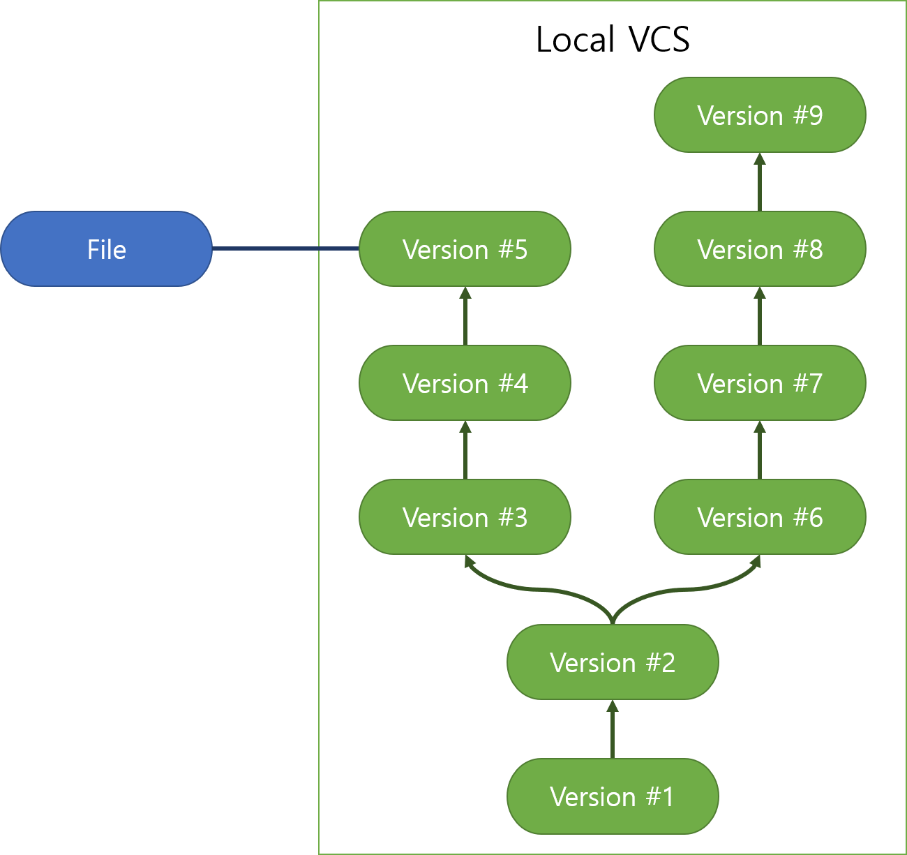
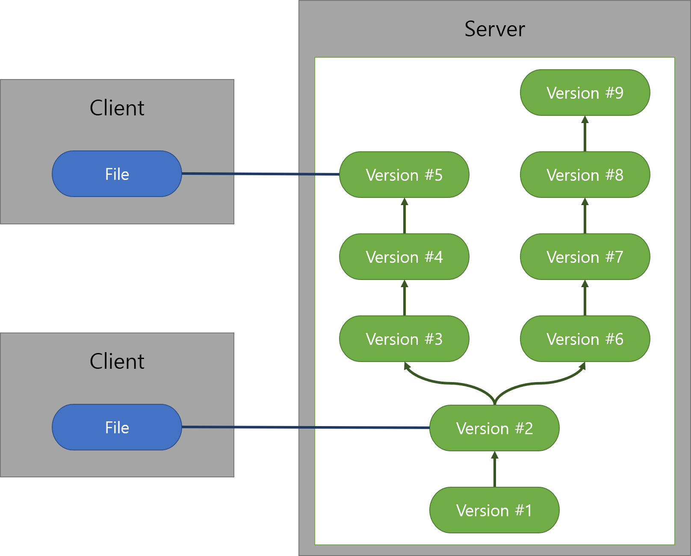
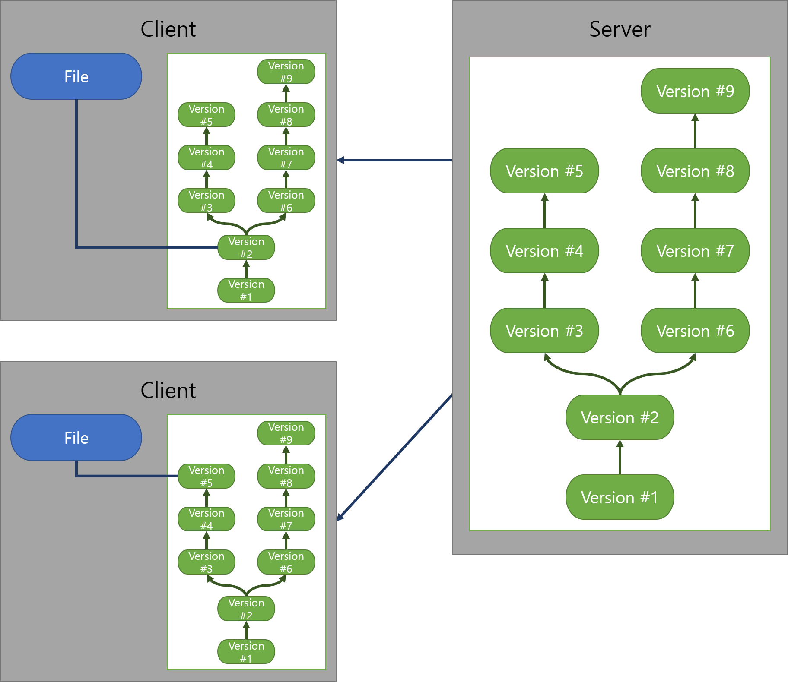

# 깃 (Git)이란?
* 2005년 리누스 토르발스에 의해 개발된 분산 버전관리 시스템(Distributed Version Control Systems - DVCS)
* 컴퓨터 파일의 변경사항을 추적하고 여러명의 사용자들 간에 파일에 대한 작업을 조율하는데 사용

# 버전관리는 왜 필요한가?
* 코드의 무결성을 유지하는 동시에  여러명의 사용자들 간에 파일에 대한 작업을 조율하는데 사용
* 버전에 따른 수정/변경 내용 비교, 문제발생 원인 추적 가능
* 파일 손실이나 오류 발생시 쉽게 복구 가능

# 버전 관리 시스템(VCS, Version Control System)의 종류
## 로컬 버전 관리 시스템 (Local VCS, Local Version Control System)
* 간단한 데이터베이스를 이용해 파일의 이력(변경 정보)를 관리하는 시스템
  * 예) RCS(Revision Control System): 파일에서 변경되는 부분(Patch)만 기억해 용량 문제를 해결
* 로컬에서만 동작하므로 다른 개발자와 협업을 해야 하는 상황에는 부적합 $\Rightarrow$ 이에 중앙 집중식 관리시스템 등



## 중앙 집중식 버전 관리 시스템 (CVCS, Centralized Version Control System)
* 중앙의 서버가 파일과 변경 이력을 관리하고, 각 클라이언트는 서버에 접속해서 특정 버전의 스냅샷(snapshot)을 받아서 사용하는 형태로 동작
* 클라이언트가 서버로부터 특정 버전의 스냅샷을 받아 사용하는 것을 체크아웃(checkout)이라고 함
* 장점
  * 여러 사람들 간의 파일, 파일 버전의 공유가 가능
  * 모든 클라이언트들이 단 하나의 데이터베이스만을 바라보므로 동기화 문제가 없으며, 관리가 편함
* 단점
  * 모든 버전 관리 관련 동작은 서버에서 처리되어야 하므로 서버의 부하가 크고, 속도가 느림
  * 서버가 죽거나 장애가 발생하면 버전 관리가 이루어지지 않음
  * 오프라인 상태에서는 버전 관리 시스템을 사용할 수 없음
  * 서버에서 데이터가 망가지거나 삭제되면 복구하기 매우 어려움



## 분산식 버전 관리 시스템 (DVCS, Distributed Version Control System)
* 중앙 집중식 버전 관리 시스템에서는 서버가 파일 및 변경 이력을 독점하기 때문에 문제가 발생 $\Rightarrow$ 분산식 버전 관리 시스템에서는 각 클라이언트들이 모두 서버의 백업본을 가짐
  * 예) Git, Mecurial, Bazaar 등
* 장점
  * 서버가 죽거나 오프라인 상태에서도 버전 관리 가능
  * 대부분의 버전 관리가 로컬에서 이루어지므로 속도도 빠름
* 단점
  * 중앙 집중식 버전 관리 시스템에 비해 복잡
  * 동기화 문제



## 로컬 저장소 설정

```bash
$ git init
Initialized empty Git repository in D:/test/.git/
(main) $
```

* `.git` 숨김 폴더가 생성
* `(main)` 브랜치 표기

## 사용자 설정

```bash
# 유저 설정 (이름, 이메일)
git config --global user.name "username"
git config --global user.email "username@gmail.com"

# 확인
git config --global user.name
git config --global user.email

# 기본 브랜치명 변경
git config --global init.defaultBranch main
git config --global init.defaultBranch

```
