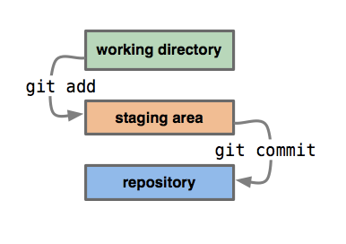
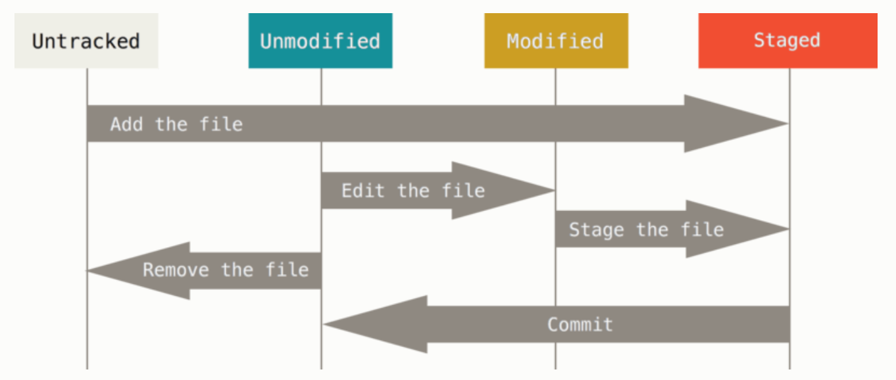

# 깃 저장소 (Git Repository)
* Git이 버전 관리를 하고 있는 폴더 의미
* Git에는 로컬 저장소(Local Repository)와 원격 저장소(Remote Repository)가 있음 

## 로컬 저장소 (Local Repository)
* 로컬 저장소는 사용자의 컴퓨터(로컬)에 저장된 Git 저장소
* 로컬에 있기 때문에 오프라인 상태에서도 버전 관리가 가능
* 로컬 저장소를 만드는 방법은 두 가지가 있음
  - 아직 버전 관리를 하지 않는 로컬 디렉토리를 새로운 Git 저장소로 만듦 $\Rightarrow$ ```git init```
  - 원격 저장소를 복제  $\Rightarrow$ ```git clone```


### Git의 로컬저장소 구성
- Working Directory : 사용자 작업 프로젝트의 디렉토리
- Staging Area (Index) : `$ git add` 명령어로 추가한 파일들이 모여있는 공간
- Repository : `$ git commit` 명령어를 실행하면 Staging Area에 있는 파일들이 하나의 버전으로 저장되는 공간



### Git의 파일 상태 라이프사이클
- Untracked: 저장소에 저장되지 않아 Git으로 버전관리를 하지 않는 상태
- Tracked: 파일 수종/변경을 Git이 추적하는 상태
  - Staged: Staging Area에 반영된 상태
  - Unmodified: staging area에 있는 파일들을 커밋하게 되면 해당 파일들은 하나의 커밋으로 저장된 후, Unmodified 상태로 변경
  - Modified: Unmodified 상태의 파일들을 수정하게 되면 Modified 로 변경




### 로컬 저장소 새로 만들기 : git init
- 특정 디렉토리를 로컬 저장소로 만들고 싶다면 해당 디렉토리로 이동한 후 다음 명령어를 입력

```bash
$ git init
Initialized empty Git repository in D:/test/.git/
(main) $
```
    - 디렉토리 밑에 `.git` 숨김 폴더가 생성
      - Git은 이 폴더 안에 변경 이력 등 버전 관리를 위한 파일들을 모두 저장
      - 이 디렉토리를 지우면 Git은 더이상 버전 관리를 할 수가 없음
      - 해당 폴더를 더이상 로컬 저장소로 사용하고 싶지 않다면(버전관리 중단), 그냥 `.git` 디렉토리 삭제 $\Rightarrow$ ```$ rm -rf .git```      

    - `(main)` 브랜치 표기

### 원격 저장소 복제하기 : git clone
```git clone``` 명령어를 이용하면 원격 저장소를 로컬로 복제할 수 있음

```bash
git clone <url> <dir_name>
```
* `<url>` : [필수] 원격 저장소 url
* `<dir_name>` : [생략 가능] 원격 저장소가 복제될 위치. 생략하면 원격 저장소의 이름을 딴 디렉토리 밑에 로컬 저장소가 생성
* 사용 예: ``` git clone https://github.com/microsoft/vscode.git happy ```
  - VSCode의 Git 로컬 저장소가 원격 저장소로부터 복제되어 ~/happy/ 디렉토리 밑에 생성됨


### 로컬 저장소 Staging area 올리기: git add
특정 파일을 Staging Area에 올리기 (해당 파일은 untracked $\rightarrow$ tracked 상태로 변경)

```bash
$ git add <file_name> 
```

현재 디렉토리 및 하위에 있는 폴더/파일의 모든 변경 내용을 Staging Area에 올리기 (`.gitignore`에 있는 파일은 제외)
```bash
$ git add .
```
작업 디렉토리 내의 모든 변경 내용을 모두 Staging Area에 올리기 (상위, 하위 모두 포함)
```bash
$ git add -A
```
  - `git add .`명령어를 최상위 폴더에서 입력하면 `git add -A`명령어와 동일한 결과 보임

현재 디렉토리 및 하위에 있는 폴더/파일의 모든 변경 내용을 Staging Area에 올리기 (`.gitignore`에 있는 파일도 적용)
```bash
$ git add * 
```

Unstage(Staging Area $\rightarrow$ Working Directory)로 상태 변경
```bash
$ git rm --cached
```
Repository와 Working Directory 사이의 다른점을 보여주는 명령
```bash
$ git diff --cached
```

### 로컬 저장소 에 저장하기: git commit
Staging area에 올라온 파일 변경 내역을 로컬 저장소에 기록/저장 (해당 파일은 staged $\rightarrow$ tracked 상태로 변경)