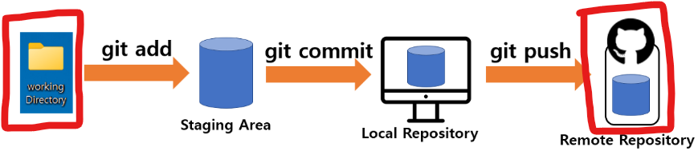

## 원격 저장소 (Remote Repository)

- 원격 저장소는 원격 컴퓨터(서버)에 저장된, 여러 사람들이 함게 공유하여 사용하는 Git 저장소
- 원격 저장소는 Git 서버에 만들 수 있음
- Git 서버는 직접 빌드할 수도 있지만, 일반적으로 깃허브(GitHub), BitBucket, GitLab 등과 같은 상용 Git 서버를 사용
  - 깃허브는 "오픈소스의 성지"라 불릴 정도로 정말 많은 오픈소스 프로젝트들이 사용하는 Git 호스팅 서비스
  - 이외에도 깃허브는 편리한 UI, 이슈 관리, 개발 프로세스 관리, 위키 페이지 등의 다양한 기능을 제공

## Git의 원격 저장소 활용 작업 패턴

1) 로컬 저장소 생성 
   - 로컬 디렉토리 신규 Git 저장소 생성 (`git int`)
   - 원격 저장소를 로컬 저장소로 복제 (`git clone`)
2) 로컬 저장소의 파일들을 수정/편집
3) 변경 내용을 저장해 로컬 저장소를 업데이트 (`git add` & `git commit`)
4) 로컬 저장소의 변경 내용을 원격 저장소로 업로드해 원격 저장소를 업데이트(동기화) (`git push`)
5) 다른 사용자들은 (원격 저장소가 갱신되었을 경우) 원격 저장소의 변경 내용을 로컬 저장소로 다운로드해 로컬 저장소를 업데이트(동기화)  (`git pull`)한다.



https://heekangpark.github.io/git/git-config


## Git의 원격 저장소 설정
원격 저장소 추가 방법
```bash
$ git remote add <rep_name> <rep_addr>
```
- <rep_name>: 원격 저장소 이름
- <rep_addr>: 원격 저장소 주소

예시: 
```bash
$ git remote add origin https://github.com/spiders22v/TIL.git    # https
$ git remote add origin git@github.com:spiders22v/TIL.git        # ssh
```

원격 저장소 목록 조회
```bash
$ git remote -v
```

원격 저장소 이름 변경
```bash
$ git remote rename <old_name> <new_name>
```

원격 저장소 삭제
```bash
$ git remote rm <rep_name>
```

## 로컬 저장소 변경 내역을 원격 저장소에 업로드하기: git push 
로컬 저장소의 브랜치를 원격 저장소로 푸시(push)하기
```bash
$ git push <rep_name> <branch>
```
- <rep_name>: push의 타겟 원격 조장소
- <branch>: push의 타겟 브랜치
- 사용자가 이 두 매개변수를 지정하지 않는다면 기본적으로 origin을 원격 저장소로, 현재 작업하고 있는 브랜치를 푸시할 브랜치로 지정

강제 푸시하기
```bash
$ git push --force-with-lease
```
- 강제적으로 푸시하나 다른 이의 작업을 덮어씌우지 않도록 보장
- `-f` 옵션은 타인이 원격 저장소에 푸시한 모든 변화까지 강제로 덮어씌울수 있으므로 가급적 사용 자제 

## 원격 저장소에서 로컬 저장소로 변경내역 가져오기: git pull 
원격 저장소의 변경내역을 가져오고 해당 내역이 현재 파일보다 더 최신 버전이면 현재 버전을 해당 소스에 맞춰 올리기 (`merge`적용)